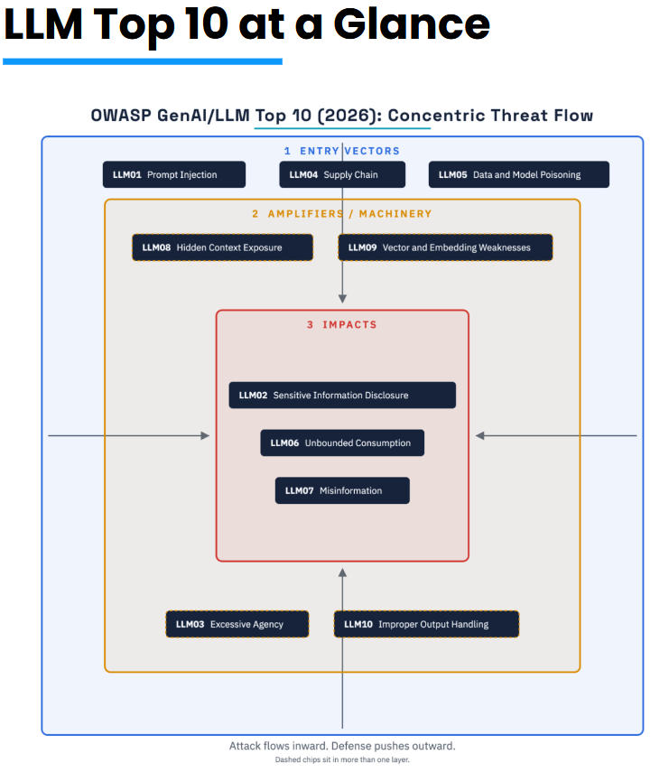

# ai-security-playbook

A practical, curated knowledge base + lab environment + framework for securing LLM applications and AI agents — built around the **OWASP GenAI LLM Top 10 (2026)**.

## Mental model: concentric layers

Attacks flow inward, defense pushes outward. This repo organizes the OWASP LLM Top 10 2026 risks into three concentric layers, plus two risks that sit on the boundary between layers:

1. **Entry vectors** (outermost — where attackers get in): `LLM01` Prompt Injection, `LLM04` Supply Chain, `LLM05` Data and Model Poisoning
2. **Amplifiers / machinery** (middle — what makes an entry vector dangerous at scale): `LLM08` Hidden Context Exposure, `LLM09` Vector and Embedding Weaknesses
3. **Impacts** (innermost — what actually goes wrong): `LLM02` Sensitive Information Disclosure, `LLM06` Unbounded Consumption, `LLM07` Misinformation
4. **Boundary risks** (can originate or manifest at any layer): `LLM03` Excessive Agency, `LLM10` Improper Output Handling

This numbering was checked against the official 2026 list before writing anything — see [docs/notes/owasp-numbering-check.md](docs/notes/owasp-numbering-check.md) for the verification trail. No divergence was found between the diagram and the official ranking.

## What's in here

| Path | Purpose |
|---|---|
| [docs/owasp-llm/](docs/owasp-llm/) | One page per OWASP LLM Top 10 2026 risk: description, attack scenarios, mitigations, tests, links |
| [docs/iso-42001/](docs/iso-42001/) | Mapping between ISO/IEC 42001 controls and practices in this repo (reference only, not a conformance claim) |
| [docs/strategies/](docs/strategies/) | Cross-cutting strategy write-ups: prompt injection defense, audit-without-blocking, etc. |
| [docs/framework/](docs/framework/) | The consolidated, adoptable framework: checklist, maturity levels, templates |
| [docs/notes/](docs/notes/) | Decisions, divergences from external sources, open questions |
| [system-prompts/](system-prompts/) | Versioned base system prompts, with rationale and tests |
| [labs/](labs/) | Reproducible, runnable security labs (see below) |
| [policies/](policies/) | Example policies, hooks, and tool allowlists |
| [resources/links.md](resources/links.md) | Curated external links, with access date and maintenance status |

### Labs

- [labs/skillspector-scan/](labs/skillspector-scan/) — using [NVIDIA SkillSpector](https://github.com/NVIDIA/SkillSpector) to scan agent skills/tools for risk
- [labs/ai-jail/](labs/ai-jail/) — sandboxing patterns for agent execution (containers, minimal permissions, network/filesystem restrictions, tool allowlists)
- [labs/prompt-anonymizer/](labs/prompt-anonymizer/) — **spike/PoC**: intercepting prompts to mask sensitive data before it reaches the model, with response re-hydration
- [labs/injection-tests/](labs/injection-tests/) — educational prompt injection test cases (direct, indirect, tool/RAG-mediated)

## Status

This repo is under active construction. Sections without content yet are placeholders with a short description of what will go there — nothing here should be read as finished guidance until it has real content and citations.

## Ground rules for this repo

- No fabricated facts, tools, or links — unverifiable claims are marked `[to verify]`.
- No copy-pasted external text — everything is summarized with a link to the source.
- Offensive security content (attack payloads, working exploits) is included where it serves an educational or defensive purpose.
- No real personal or customer data anywhere in this repo — see [CONTRIBUTING.md](CONTRIBUTING.md).

## License

[MIT](LICENSE)
